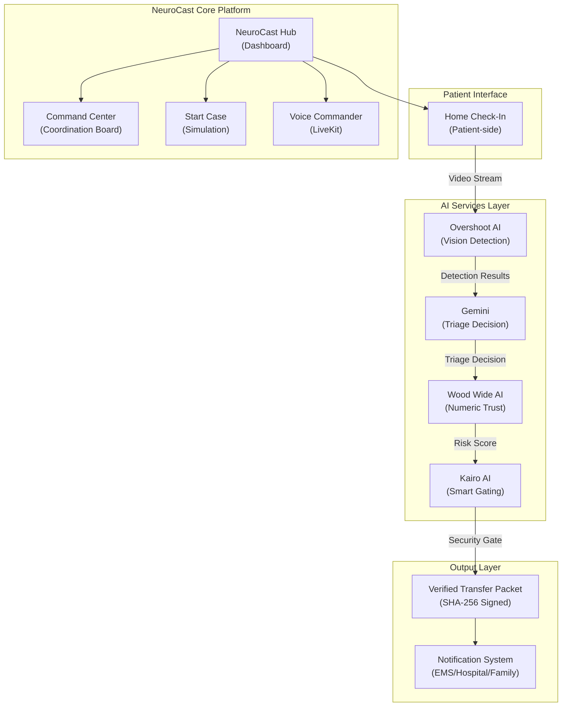
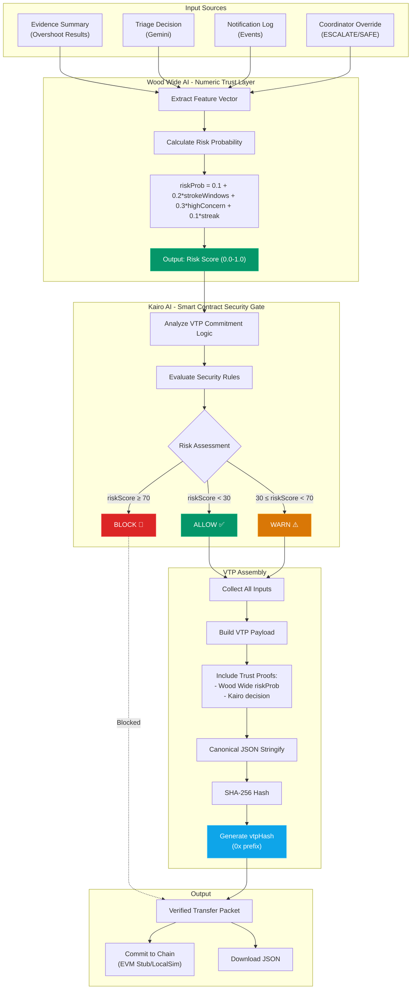
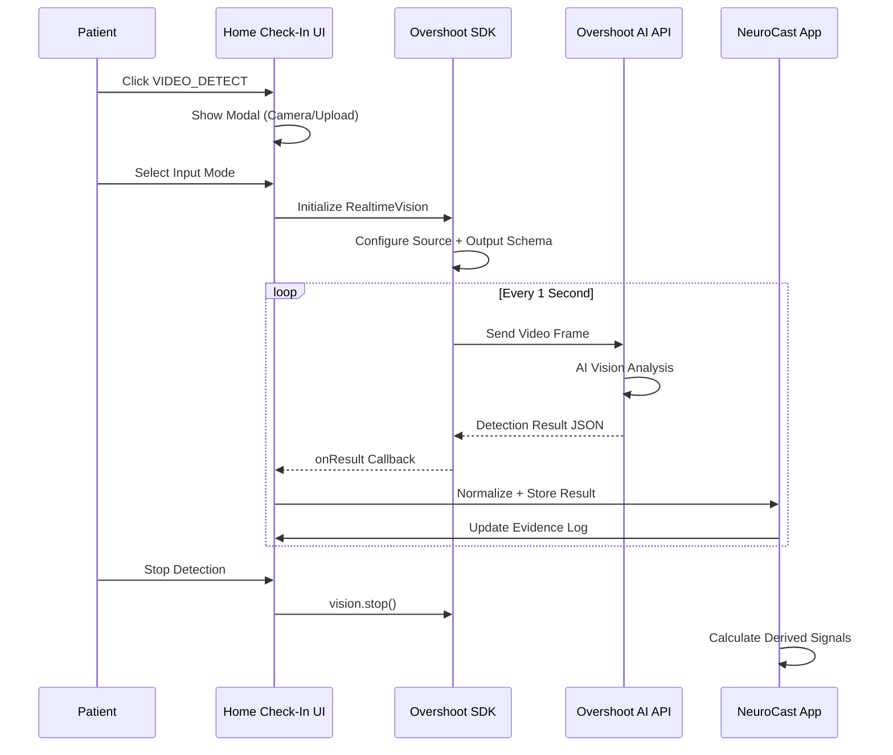

# NeuroCast AI - Technical Architecture Documentation

## 📌 System Overview

NeuroCast AI is an **autonomous stroke care coordination platform** that transforms messy transfer packets into auditable PROCEED, HOLD, or ESCALATE decisions. The system integrates multiple AI services (Overshoot AI for vision, Gemini for triage, Wood Wide for numeric trust, and Kairo for smart contract security) into a unified pipeline.

---

## 🏗️ High-Level System Architecture



---

## 🔄 Home Check-In Feature - Deep Technical Flowchart

The Home Check-In module enables patients to initiate verified transfer cases via video telemetry and AI-powered triage.

```mermaid
flowchart TD
    subgraph "1. SESSION INIT"
        A["Patient Opens Home Check-In"] --> B["Create Session<br/>(HCI-timestamp-uuid)"]
        B --> C["Initialize State Machine<br/>(Step: HOME_CHECKIN)"]
    end

    subgraph "2. VIDEO_DETECT"
        C --> D{"User Action"}
        D -->|"Start Camera"| E["Request Camera Permission"]
        D -->|"Upload Video"| F["Select Video File"]
        E --> G["Overshoot SDK Init<br/>(RealtimeVision)"]
        F --> G
        G --> H["Stream Frames to<br/>Overshoot AI API"]
        H --> I["Receive Detection Results<br/>(1 result/sec)"]
        I --> J["Normalize Result<br/>(signal_type, severity, confidence)"]
        J --> K["Update Derived Signals<br/>(possibleStrokeWindows, avgConfidence)"]
        K --> L["Append to Evidence Log"]
        L --> M{"More Frames?"}
        M -->|"Yes"| H
        M -->|"No"| N["Step: VIDEO_DETECT Complete"]
    end

    subgraph "3. TRIAGE"
        N --> O{"≥5 Results?"}
        O -->|"No"| P["Show Warning Toast"]
        O -->|"Yes"| Q["POST /api/homecheckin/triage"]
        Q --> R["Gemini Analyzes<br/>Derived Signals"]
        R --> S["Return TriageDecision<br/>(urgency, what_happened, why_it_matters, what_next)"]
        S --> T["Store in Session"]
        T --> U["Step: TRIAGE Complete"]
    end

    subgraph "4. NOTIFY"
        U --> V{"Override Applied?"}
        V -->|"ESCALATE"| W["Force HIGH urgency"]
        V -->|"SAFE"| X["Cap at MODERATE"]
        V -->|"None"| Y["Use Triage urgency"]
        W --> Z["POST /api/homecheckin/notify"]
        X --> Z
        Y --> Z
        Z --> AA["Generate NotifyEvents<br/>(EMS, Hospital, Family)"]
        AA --> AB["Append to notifyLog"]
        AB --> AC["Step: NOTIFY Complete"]
    end

    subgraph "5. VTP GENERATION"
        AC --> AD["Calculate Wood Wide Risk<br/>(riskProb = f(derivedSignals))"]
        AD --> AE["Kairo Security Gate<br/>(ALLOW/WARN/BLOCK)"]
        AE --> AF{"Decision?"}
        AF -->|"BLOCK"| AG["Disable Commit Button"]
        AF -->|"ALLOW/WARN"| AH["POST /api/homecheckin/vtp"]
        AH --> AI["Assemble VTP Payload"]
        AI --> AJ["SHA-256 Hash Signature"]
        AJ --> AK["Return vtpHash"]
        AK --> AL["Display VTP + Download Option"]
    end

    style A fill:#1e3a5f,stroke:#4ade80,color:#fff
    style N fill:#065f46,stroke:#4ade80,color:#fff
    style U fill:#7c2d12,stroke:#f97316,color:#fff
    style AC fill:#5b21b6,stroke:#a78bfa,color:#fff
    style AL fill:#0f766e,stroke:#2dd4bf,color:#fff
```



---

## 🔐 VTP Technology - Verified Transfer Packet Flowchart

The VTP blends Wood Wide AI (numeric trust layer) and Kairo AI (smart contract security) into a tamper-proof cryptographic commitment.



---

## 🎯 Overshoot AI Integration



### Overshoot SDK Configuration

| Parameter | Value | Description |
|-----------|-------|-------------|
| `clip_length_seconds` | 1 | Analysis window size |
| `delay_seconds` | 1 | Buffer before processing |
| `fps` | 30 | Frame capture rate |
| `sampling_ratio` | 0.1 | Frame sampling for efficiency |

### Output Schema (Enforced)

```json
{
  "signal_type": "no_concern | possible_stroke | high_concern | uncertain",
  "severity": "low | medium | high | critical",
  "confidence": 0.0 - 1.0,
  "face_droop": boolean,
  "arm_weakness": boolean,
  "speech_difficulty": boolean,
  "gait_instability": boolean,
  "notes": "string"
}
```

---

## 📂 Project Structure

```
neurocastai-3/
├── apps/
│   └── web/                           # Next.js 15 Application
│       ├── app/                       # App Router Pages
│       │   ├── page.tsx               # NeuroCast Hub Dashboard
│       │   ├── home-checkin/          # Home Check-In Feature
│       │   │   └── page.tsx           # Full State Machine UI
│       │   ├── command-center/        # Case Coordination Board
│       │   ├── start-case/            # Simulation Tools
│       │   ├── voice-commander/       # LiveKit Voice Interface
│       │   └── api/                   # API Routes
│       │       ├── homecheckin/
│       │       │   ├── triage/        # Gemini Triage API
│       │       │   ├── notify/        # Notification Events API
│       │       │   └── vtp/           # VTP Generation API
│       │       ├── kairo/             # Security Gate API
│       │       ├── vtp/               # VTP Verification API
│       │       └── run/               # Pipeline Execution API
│       ├── lib/                       # Core Libraries
│       │   ├── overshoot/             # Overshoot SDK Integration
│       │   │   └── useOvershootVision.ts
│       │   ├── woodwide/              # Wood Wide AI Client
│       │   │   └── woodwideClient.ts
│       │   ├── kairo/                 # Kairo Security Client
│       │   │   └── kairoClient.ts
│       │   ├── vtp.ts                 # VTP Hash Generation
│       │   ├── pipelineRunner.ts      # Main Pipeline Logic
│       │   └── compressionPolicy.ts   # NeuroCast Compression
│       └── .env.local                 # Environment Variables (gitignored)
│
├── packages/
│   └── shared/                        # @neurocast/shared Types
│       └── src/
│           └── index.ts               # TriageDecision, OvershootNormalizedResult
│
├── src/                               # Legacy Vite UI
│   └── components/
│       └── ui/                        # Reusable UI Components
│
├── contracts/                         # Smart Contract Stubs
├── data/                              # Synthetic Demo Cases
├── docs/                              # Additional Documentation
│
├── .gitignore                         # Excludes .env.*, node_modules, .next
├── SAFETY.md                          # PHI Handling & Compliance
├── README.md                          # Main Documentation
└── ARCHITECTURE.md                    # This File
```

---

## 🛠️ Technology Stack

### Frontend
| Technology | Purpose |
|------------|---------|
| **Next.js 15** | React framework with App Router |
| **React 19** | UI component library |
| **TypeScript 5.x** | Type-safe development |
| **Tailwind CSS** | Utility-first styling |
| **Lucide React** | Icon library |
| **Sonner** | Toast notifications |

### AI Services
| Service | Purpose | Integration |
|---------|---------|-------------|
| **Overshoot AI** | Real-time video analysis for stroke detection | SDK via `@overshoot/sdk` |
| **Google Gemini** | AI-powered triage decision generation | REST API via `@google/generative-ai` |
| **Wood Wide AI** | Numeric trust scoring and risk probability | REST API |
| **Kairo AI** | Smart contract security gating | REST API |

### Security & Verification
| Component | Implementation |
|-----------|----------------|
| **VTP Hash** | SHA-256 cryptographic signature |
| **Kairo Gate** | ALLOW/WARN/BLOCK security decisions |
| **PHI Protection** | Regex-based redaction before processing |

---

## 🔒 Security Considerations

1. **API Keys**: All sensitive keys stored in `.env.local` (gitignored)
2. **PHI Redaction**: Patient identifiers removed before AI processing
3. **VTP Integrity**: SHA-256 hash ensures tamper detection
4. **Kairo Gating**: Blocks commits when security risks detected
5. **No Diagnosis**: System performs coordination, NOT medical diagnosis

---

## 📊 Key Metrics

| Feature | Metric | Value |
|---------|--------|-------|
| Compression | Token Savings | 72.6% |
| Detection | Frame Rate | 1 result/sec |
| Triage | Min Observations | 5 |
| VTP | Hash Algorithm | SHA-256 |
| Security | Gate Levels | 3 (ALLOW/WARN/BLOCK) |

---

## 🚀 Quick Start

```bash
# Install dependencies
npm install

# Start development server
npm --prefix apps/web run dev

# Open in browser
# http://localhost:3000
```

---

*Generated: 2026-01-24 | NeuroCast AI Team*
